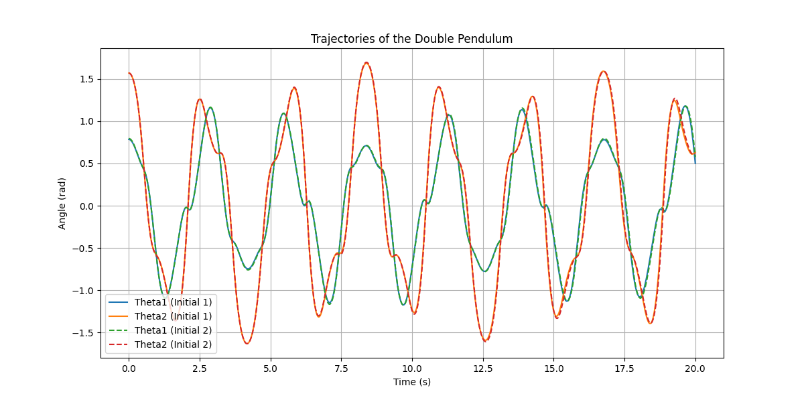
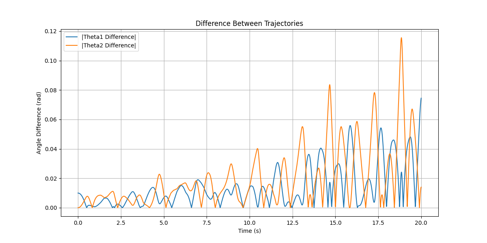

# Double Pendulum and Sensitivity to Initial Conditions

## Overview

The double pendulum is a classic example of a chaotic system. Its motion is highly sensitive to initial conditions, making it an excellent demonstration of chaos in dynamic systems.

The equations of motion for the double pendulum are derived from the Lagrangian and are solved numerically for this analysis.

---

## Python Code Example: Simulating and Plotting Trajectories

Here is a Python code snippet to simulate and visualize the trajectories of a double pendulum for two slightly different initial conditions:

```python
import numpy as np
import matplotlib.pyplot as plt
from scipy.integrate import solve_ivp

# Constants for the double pendulum
L1, L2 = 1.0, 1.0  # lengths of the pendulum arms
M1, M2 = 1.0, 1.0  # masses of the pendulums
g = 9.81  # acceleration due to gravity

def double_pendulum_ode(t, y):
    """Defines the equations of motion for the double pendulum."""
    theta1, z1, theta2, z2 = y  # Unpack the state vector
    
    delta = theta2 - theta1
    den1 = (M1 + M2) * L1 - M2 * L1 * np.cos(delta) ** 2
    den2 = (L2 / L1) * den1

    dydt = np.zeros_like(y)
    dydt[0] = z1
    dydt[1] = (
        M2 * L1 * z1 ** 2 * np.sin(delta) * np.cos(delta)
        + M2 * g * np.sin(theta2) * np.cos(delta)
        + M2 * L2 * z2 ** 2 * np.sin(delta)
        - (M1 + M2) * g * np.sin(theta1)
    ) / den1
    dydt[2] = z2
    dydt[3] = (
        -M2 * L2 * z2 ** 2 * np.sin(delta) * np.cos(delta)
        + (M1 + M2) * g * np.sin(theta1) * np.cos(delta)
        - (M1 + M2) * L1 * z1 ** 2 * np.sin(delta)
        - (M1 + M2) * g * np.sin(theta2)
    ) / den2
    return dydt

# Initial conditions: two similar starting states
y0_1 = [np.pi / 4, 0, np.pi / 2, 0]  # [theta1, theta1_dot, theta2, theta2_dot]
y0_2 = [np.pi / 4 + 0.01, 0, np.pi / 2, 0]  # Slightly perturbed

# Time span for the simulation
t_span = (0, 20)
t_eval = np.linspace(t_span[0], t_span[1], 2000)

# Solve the equations of motion
sol1 = solve_ivp(double_pendulum_ode, t_span, y0_1, t_eval=t_eval, method='RK45')
sol2 = solve_ivp(double_pendulum_ode, t_span, y0_2, t_eval=t_eval, method='RK45')

# Plot the trajectories of theta1 and theta2
plt.figure(figsize=(12, 6))
plt.plot(t_eval, sol1.y[0], label="Theta1 (Initial 1)")
plt.plot(t_eval, sol1.y[2], label="Theta2 (Initial 1)")
plt.plot(t_eval, sol2.y[0], label="Theta1 (Initial 2)", linestyle="--")
plt.plot(t_eval, sol2.y[2], label="Theta2 (Initial 2)", linestyle="--")
plt.title("Trajectories of the Double Pendulum")
plt.xlabel("Time (s)")
plt.ylabel("Angle (rad)")
plt.legend()
plt.grid()
plt.show()

# Plot the difference in trajectories
plt.figure(figsize=(12, 6))
plt.plot(t_eval, np.abs(sol1.y[0] - sol2.y[0]), label="|Theta1 Difference|")
plt.plot(t_eval, np.abs(sol1.y[2] - sol2.y[2]), label="|Theta2 Difference|")
plt.title("Difference Between Trajectories")
plt.xlabel("Time (s)")
plt.ylabel("Angle Difference (rad)")
plt.legend()
plt.grid()
plt.show()
```




---

## Key Insights

1. **Trajectories Diverge Rapidly:** Even with a small initial difference, the trajectories of the double pendulum diverge quickly, illustrating chaotic behavior.

2. **Visualization of Sensitivity:** The second plot clearly shows how the differences grow over time, emphasizing the system's sensitivity to initial conditions.

---

## Suggested Projects

1. **Energy Analysis:** Calculate and plot the total energy of the system to verify conservation laws.
2. **3D Visualization:** Extend the analysis to visualize the pendulum's motion in 3D space.
3. **Real-World Experiment:** Compare the simulation to a physical double pendulum setup.
4. **Parameter Variation:** Investigate how varying lengths and masses affect the system's dynamics.

---

This example demonstrates the chaotic nature of the double pendulum and its sensitivity to initial conditions. Try modifying the initial states or parameters to observe how the system behaves!
