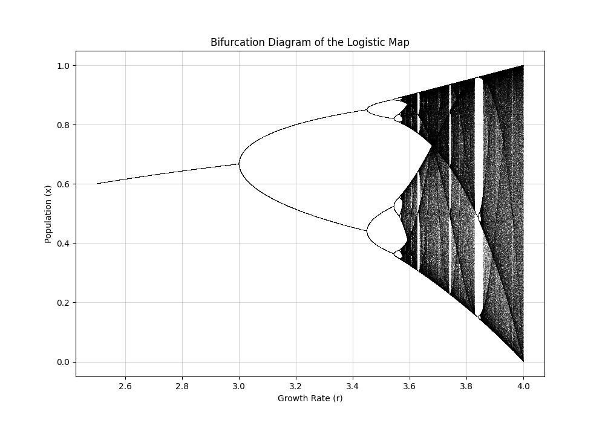

# Logistic Equation and Bifurcation

## Overview

The logistic equation is a simple mathematical model that describes population growth with a carrying capacity. The equation is:

$$ x_{n+1} = r x_n (1 - x_n) $$

Where:

- $x_n$ is the population at generation $n$ (normalized between 0 and 1).
- $r$ is the growth rate parameter.

This model exhibits interesting dynamics as the parameter $r$ varies, leading to bifurcations and chaotic behavior.

---

## Python Code Example: Simulating and Plotting Bifurcations

Here is a Python code snippet to simulate and visualize the bifurcation diagram of the logistic equation:

```python
import numpy as np
import matplotlib.pyplot as plt

# Define the logistic map function, which calculates the next population value
# given the current population (x) and the growth rate (r).
def logistic_map(r, x):
    return r * x * (1 - x)  # Core equation of the logistic map

# Function to generate and plot the bifurcation diagram
def bifurcation_diagram(r_min=2.5, r_max=4.0, steps=10000, discard=1000, plot_points=200):
    # Generate a range of r values between r_min and r_max.
    r_values = np.linspace(r_min, r_max, steps)
    
    # Initialize the population values with an array of 0.5 (arbitrary starting value).
    x = 0.5 * np.ones(steps)

    # Set up the figure for plotting.
    plt.figure(figsize=(10, 7))

    # Iterate to discard transient dynamics, ensuring we only analyze steady-state behavior.
    for _ in range(discard):
        x = logistic_map(r_values, x)

    # After discarding transients, iterate again to collect data points for the diagram.
    for _ in range(plot_points):
        x = logistic_map(r_values, x)
        # Plot the r values against the current population values (x).
        plt.plot(r_values, x, ',k', alpha=0.25)  # ',' creates small dots for a dense diagram

    # Add plot titles and labels for clarity.
    plt.title("Bifurcation Diagram of the Logistic Map")
    plt.xlabel("Growth Rate (r)")
    plt.ylabel("Population (x)")
    plt.grid(True, alpha=0.5)  # Optional grid for better readability
    plt.show()

# Entry point to execute the bifurcation diagram plot.
if __name__ == "__main__":
    bifurcation_diagram()  # Call the function with default parameters
```



---

## Key Insights

1. **Stable Fixed Points:** For small $r$, the population converges to a single fixed point.
2. **Periodic Orbits:** As $r$ increases, bifurcations occur, leading to periodic cycles.
3. **Chaos:** For $r \geq 3.57$, chaotic behavior is observed, where the population no longer settles into predictable cycles.

---

## Applications

- Ecology: Modeling species populations.
- Economics: Describing market dynamics.
- Physics: Exploring chaotic systems.

---

## Advanced Exploration

### Suggested Student Projects

Students can extend this analysis in the following ways:

1. **Exploration of Lyapunov Exponent:** Implement a calculation of the Lyapunov exponent to quantify chaos in the logistic map. This involves computing the average divergence of nearby trajectories.

2. **Effect of Initial Conditions:** Investigate how varying the initial population $x_0$ affects the bifurcation diagram. Plot diagrams for different $x_0$ values and compare.

3. **Parameter Sensitivity:** Analyze the sensitivity of the system to small changes in the growth rate $r$ within the chaotic region. Visualize how small perturbations in $r$ can lead to different outcomes.

4. **3D Visualization:** Extend the bifurcation diagram to include a time dimension, creating a 3D plot to visualize the dynamics.

5. **Applications in Real-World Data:** Apply the logistic map to real-world data, such as population studies or stock market fluctuations, to see how well it models observed behaviors.

6. **Programming Challenge:** Implement the bifurcation diagram using a different programming language or visualization library (e.g., JavaScript with D3.js or MATLAB).

---

This is an introductory example to explore the fascinating behavior of dynamic systems through the logistic equation. Try tweaking the parameters in the code to see how the system's behavior changes!
